# Week 3 :Data warehouse
    
| Column 1 | OLTP | OLAP |
|----------|----------|----------|
| Purpose| Short, fast updates initiated by user| Data periodically refreshed with scheduled, long-running batch jobs|
|Database design | Normalized databases for efficiency	| Denormalized databases for analysis|
|Space requirements|	Generally small if historical data is archived	| Generally large due to aggregating large datasets|
|Backup and recovery|	Regular backups required to ensure business continuity and meet legal and governance requirements|	Lost data can be reloaded from OLTP database as needed in lieu of regular backups|
|Productivity | Increases productivity of end users	| Increases productivity of business managers, data analysts and executives|
|Data view|	Lists day-to-day business transactions|	Multi-dimensional view of enterprise data|
|User examples| Customer-facing personnel, clerks, online shoppers| Knowledge workers such as data analysts, business analysts and executives|

## Google Big query 


BigQuery (BQ) is a Data Warehouse solution offered by Google Cloud Platform.

- BQ is serverless. There are no servers to manage or database software to install; this is managed by Google and it's transparent to the customers.

- BQ is scalable and has high availability. Google takes care of the underlying software and infrastructure.

- BQ has built-in features like Machine Learning, Geospatial Analysis and Business Intelligence among others.

- BQ maximizes flexibility by separating data analysis and storage in different compute engines, thus allowing the customers to budget accordingly and reduce costs.


## External tables

External tables are objects that are similar to views of a database. Only that this time the database isn't really a database but files in some cloud storage or another database. It stores only the schema in BQ and only infers the data from the extenal files when creating the object. External tables have the same characteristics as a standard table in BigQuery, with their properties, access management, metadata, and so on. The only difference is that they are a view, the data is in another location.

For example, instead of ingesting a CSV into a table in the BigQuery database, let's create an external table to directly access the data without persisting:

```sql
CREATE OR REPLACE EXTERNAL TABLE 'de-project-397922.trips_data_all.rides'
OPTIONS (
    format = 'CSV',
    uris   = ['gs://data/trip/yellow_tripdata_2020-01.csv']
);
```

## Google BigQuery Optimization
Unlike a relational database, BigQuery doesn't support indexes to streamline SQL queries. Instead, it offers two alternatives: `partitioning` and `clustering`. These options are not recommended when our data volume is < 1GB.

## Partitioning
A partitioned table is a table divided into segments aka partitions based on the values of a column. Slicing a table greatly speeds up queries because the data you need to retrieve is much smaller than if you had to read the entire table. BigQuery offers three types of partitions:

- **Integer Range Partitioning**: Partitions are created based on the numeric value of a column of type . For example, by the country code.`INTEGER`
    
- **Partitioning columns per unit of time**: The most common partition, the table is partitioned by a column of type , or .`DATETIMESTAMP DATETIME`

- **Ingestion-time partitioning**: BigQuery automatically assigns rows to partitions based on when BigQuery transfers data. You can choose the level of detail by hour, day, month, or year for partitions. It has a limit of 4k partitions. The column is added and in each tuple the value of the moment in which the data was stored is assigned.`_PARTITIONTIME`

Partitions are used to improve performance when you have large datasets that require frequent queries on specific date ranges or time intervals. For example we creata a new table from a query and add the partition by column `tpep_pickup_datetime`
```sql
CREATE OR REPLACE TABLE trips_data_all.partitioned_database
PARTITION BY
  DATE(tpep_pickup_datetime) AS
SELECT * FROM trips_data_all.rides LIMIT 50;
```

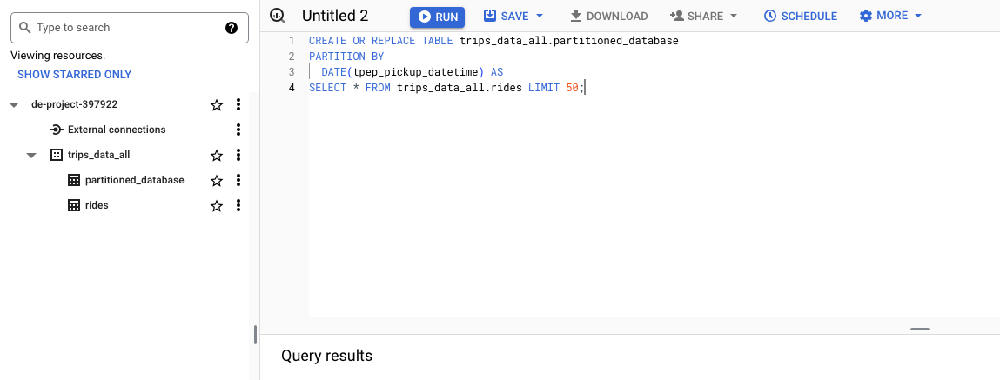

Partitions are used to improve query performance as they allow you to filter data based on partition keys. This can significantly reduce the amount of data that is processed.

The new table partitioned_database is created with a partition
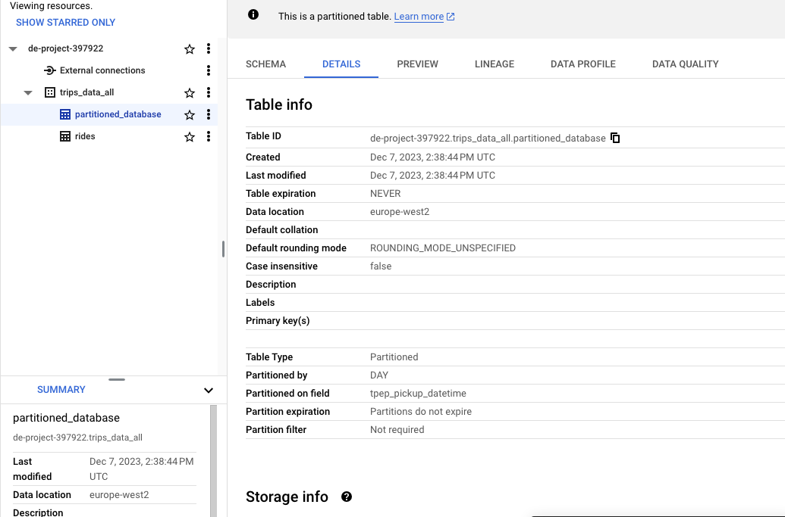


## Clustering
Clustering reorders the data in the table based on one or more columns (up to 4). Features of column grouping in BigQuery:

- The order of the grouped columns is relevant in determining the priority of the columns
- Improves performance in queries that use predicates or aggregation functions
- Works much better with columns with a high cardinality (email, categories, names)
- You can group them into columns of type:
- `DATE`
- `BOOL`
- `GEOGRAPHY`
- `INT64`
- `NUMERIC`
- `BIGNUMERIC`
- `STRING`
- `TIMESTAMP`
- `DATETIME`

Limit a maximum of 4 clustered columns per table.
Example:
We can create clusters at the same time as partitions. Building upon the previous query as an example, let's add a grouped column or cluster by the field :VendorID

```sql
CREATE OR REPLACE TABLE trips_data_all.partitioned_database_partitioned
PARTITION BY DATE(tpep_pickup_datetime)
CLUSTER BY VendorIDKEY AS
SELECT *, CAST(VendorID AS STRING) AS VendorIDKey FROM trips_data_all.rides LIMIT 1000;
```

you cannot cluster on float, hence the conversion to string as `VendorIDKey`

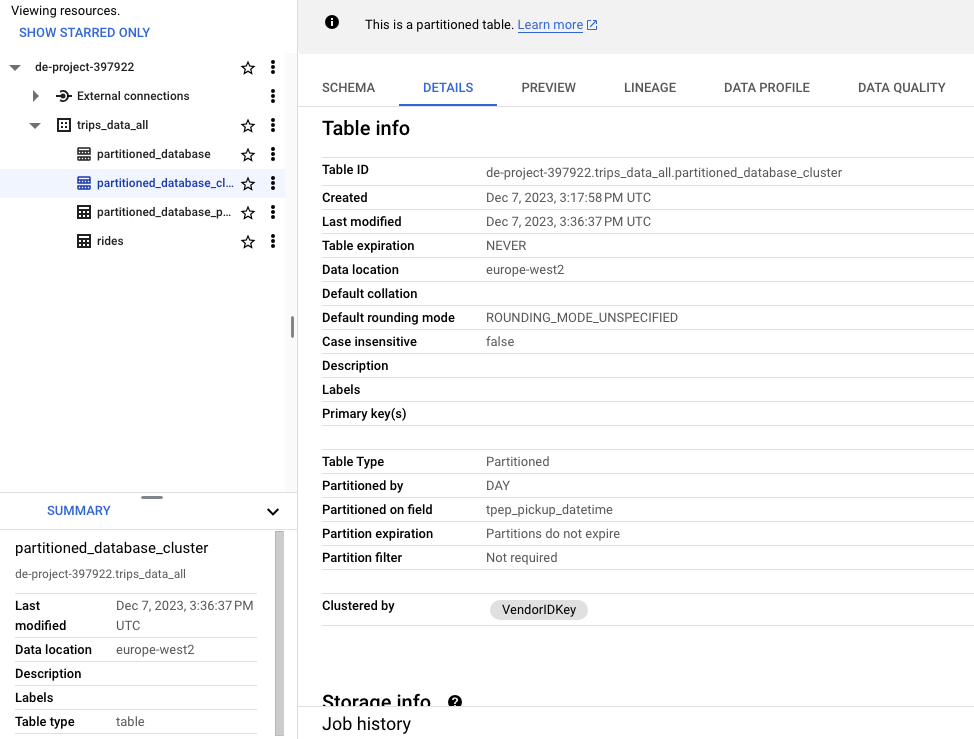
<p align="center">Partitioned and clustered</p>

## When to use partitioning and clustering?

Use partitioning when you want to filter or aggregate data on a single column with low cardinatlity (few number of unique elements) and if we want to filter or aggregate on several columns we can partition with the column with the least cardinatlity and cluster by the rest up to a maximum of 4 columns. BigQuery sorts the data using the values in the clustering columns. When you cluster a table, BigQuery stores the data in a way that is optimized for queries that filter, aggregate, or join on the clustering columns 1. This can result in faster query response times and lower costs

|Partitioning | Clustering |
|--------------|-----------|
| The cost of the query is known. BigQuery can estimate the amount of data it will retrieve before running the query.|	The cost of the query is unknown as it cannot estimate the amount of data.|
| Low granularity. You can only partition per column.	| High granularity. Multiple columns can be used to reorder the table (up to a maximum of 4)|
| Focused for queries that filter or aggregate data by a single column. | Focused for queries that filter or aggregate by multiple columns.|
| Limit 4K partitions of a column, which implies that it can only be used with fields with low cardinality (or up to 4K).|	There is no limit to clusters, so it supports columns with high cardinality.|


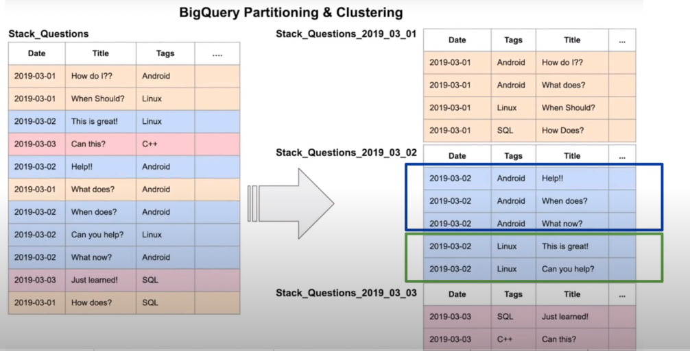
<p align="center">Big Query table Optimized by partitioning on date</p>


## SQL Best Practices for Optimizing Queries
Most of them don't just apply to Google BigQuery, they are recommendations for queries run on any database engine:

- Avoid using, the ideal is to recover only the columns that we need or are going to use. Avoid `SELECT *`
- Evaluate the cost of running the query before launching it. This is especially useful in cloud environments where the selected billing is per run (you pay for each run), which is typically more expensive than if you select a capacity or package.
- Apply partitioning and/or clustering optimization
- In real-time cases, we must pay attention and be careful with data ([insertAll](https://cloud.google.com/bigquery/docs/streaming-data-into-bigquery?hl=es-419) `INSERT`)
- Create **materialized views** as intermediate steps when the query must handle a large volume of data. Note that BigQuery also caches column results.
- Apply filters by partition or grouping columns (clusters)
- Denormalize the data by lowering normal forms to a minimum, in other words, destroy referential integrity by keeping all data in a single table to avoid joins between several. We recommend that you use nested fields with or . Although it has certain disadvantages (more storage due to repeating data and loss of data integrity), it is the most optimal way to exploit large volumes of data. `STRUCT ARRAY`
- Try using HyperLogLog++ or HLL++ rough aggregation functions. It needs less memory than exact aggregation functions, such as , but they generate statistical uncertainty. They are very useful for large volumes of data where the use of linear memory is impractical considering that the data returned to us is a statistical approximation, not the exact value.COUNT(DISTINCT)
- Avoid using your own SQL or JavaScript UDF functions
- When you cross multiple tables, arrange the one by placing the largest one first. It will be the one that BigQuery uses first to distribute it through the nodes and the following tables will be distributed to each one. Also, try to reduce the size of subqueries or materialized views before making crossings.`JOIN`

## Google BigQuery Architecture
The BigQuery architecture decouples storage from compute (analytics engine), allowing each resource to be scaled independently. This flexibility allows for much more granularized cost control. What pieces do we find within BigQuery? Dremel, Colossus, Jupiter and Borg:


### Borg: Container Orchestrator
Google's own container orchestrator that is responsible for providing the necessary hardware to operate the slots and mixers of the Dremel engine.

### Jupyter: Network
Because the BigQuery structure is decoupled (it physically separates the storage from the compute engine) it needs an artifact that connects both entities: Jupyter. It offers enough bandwidth to allow communication between 100K machines at an ultra-fast speed of 10Gbs/s.

### Dremel: Execution Engine
This is the high-speed BigQuery query engine that Google uses in its own search engine. It orchestrates queries by segmenting them into small portions that are distributed by nodes and when finished they are grouped together to return the result; The definition of distributed processing. **Dremel** converts a SQL query into an execution tree where we find **slots** and **mixers**, all run on Borg (see below). The engine itself dynamically assigns slots to incoming queries:

- **Slots**: these would be the leaves of the tree and they take care of the heaviest 

- **part**: reading data in Colossus and performing computational operations.
Mixers: the branches. They take care of aggregation operations

### Colossus: Distributed Storage
Google's state-of-the-art distributed storage system. It manages replications, recovery (when disks fail), and distributed management (mitigating the impact in the event of a crash). **Colossus** uses the columnar and compression format ColumnIO capable of easily handling petabytes of data.

## Big query and machine learning
Google BigQuery can run machine learning models in a simple and agile way using standard SQL without the need for specific platforms, data movement or programming knowledge (python, scala, etc). The ML algorithms natively available within BigQuery can be found in the official [documentation](https://cloud.google.com/bigquery-ml/docs/introduction?hl=es-419).

For example, to create a **linear regression** model in to predict the tip (tip_amount) of a taxi ride given the `pickup_latitude` and `pickup_longitude`. For more see the [documentation](https://cloud.google.com/bigquery-ml/docs/reference/standard-sql/bigqueryml-syntax-create) with all the options: `CREATE MODEL`.

```sql
CREATE OR REPLACE MODEL `de-project-397922.trips_data_all.rides.tip_mode;`
OPTIONS(
    model_type='linear_reg', 
    input_label_cols=['pickup_latitude','pickup_longitude'],
    output_label_col='tip_amount'
    DATA_SPLIT_METHOD='AUTO_SPLIT'
) 
AS
SELECT pickup_latitude, pickup_longitude, tip_amount 
FROM `de-project-397922.trips_data_all.rides`
WHERE NOT ISNULL(pickup_latitude) AND NOT ISNULL(pickup_longitude);
```

- `CREATE OR REPLACE MODEL` It's the sentence for creating our model
- Within the parameters and configuration of the model we are going to indicate: `OPTIONS()`

  - `MODELE_TYPE='linear_reg'` In our example, we're going to create a linear regression model. We could use any of the ones available in BQ (such as to create data clusters or to create a classification model) `KMEANS`, `RANDOM_FOREST_CLASSIFIER`

  - INPUT_LABEL_COLS=['tip_amount'] An array of comma-separated columns that we're going to use to train and use the model.

  - DATA_SPLIT_METHOD='AUTO_SPLIT' We specify that we want to automatically divide the dataset into two parts, one for training and one for training (training/test).

- It specifies the data source, as well as the predicate if there is one (filter).SELECT


BQ offers us a series of statements to analyze and exploit the model. More information in the official documentation.

- `ML.FEATURE_INFO` :Displays statistics for each column in the dataset (minimum and maximum values, averages, and so on). Similar to running the de command in Pandas (python). `describe()`
- `ML.EVALUATE` :Displays a model's metrics, ideal for testing with a new dataset how the model would respond. the metrics it offers are the same as those that we can consult by looking at the detail of the model created from the GCP GUI.
- `ML.PREDICT` : Allows us to run the model on a dataset and generate the predictions for which it has been configured.
- `ML.EXPLAIN_PREDICT`: adds information to the previous statement about which of the columns or features are the most helpful in calculating the prediction.

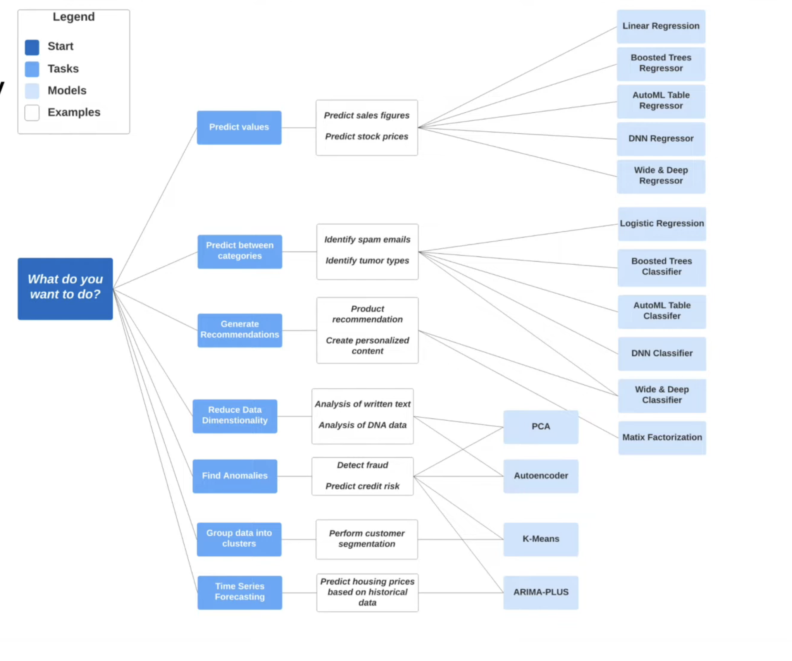

## SELECT THE COLUMNS INTERESTED FOR YOU
SELECT trip_distance, PULocationID, DOLocationID, payment_type, fare_amount, tolls_amount, tip_amount
FROM `de-project-397922.trips_data_all.partitioned_database_cluster`
WHERE fare_amount != 0;

## CREATE ML TABLE
```sql
CREATE OR REPLACE TABLE `de-project-397922.trips_data_all.partitioned_database_cluster_ml`(
`trip_distance` FLOAT64,
`PULocationID` STRING,
`DOLocationID` STRING,
`payment_type` STRING,
`fare_amount` FLOAT64,
`tolls_amount` FLOAT64,
`tip_amount` FLOAT64
) AS (
SELECT trip_distance, cast(PULocationID AS STRING), CAST(DOLocationID AS STRING),
CAST(payment_type AS STRING), fare_amount, tolls_amount, tip_amount
FROM `de-project-397922.trips_data_all.partitioned_database_cluster` WHERE fare_amount != 0
);
```

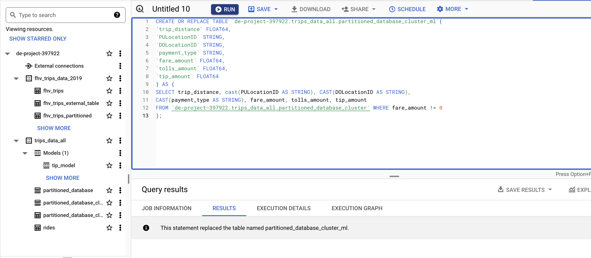

## CREATE MODEL

```sql
CREATE OR REPLACE MODEL `de-project-397922.trips_data_all.tip_model`
OPTIONS
(model_type='linear_reg',
input_label_cols=['tip_amount'],
DATA_SPLIT_METHOD='AUTO_SPLIT') AS
SELECT
*
FROM `de-project-397922.trips_data_all.partitioned_database_cluster_ml`
WHERE
tip_amount IS NOT NULL;
```

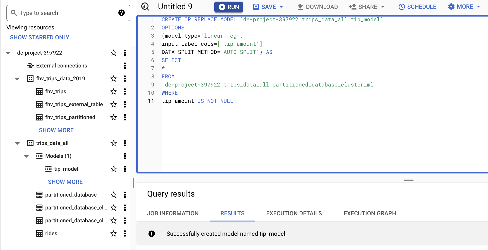

## CHECK FEATURE MODEL

```sql
SELECT * 
FROM ML.FEATURE_INFO(MODEL `de-project-397922.trips_data_all.tip_model`)
```

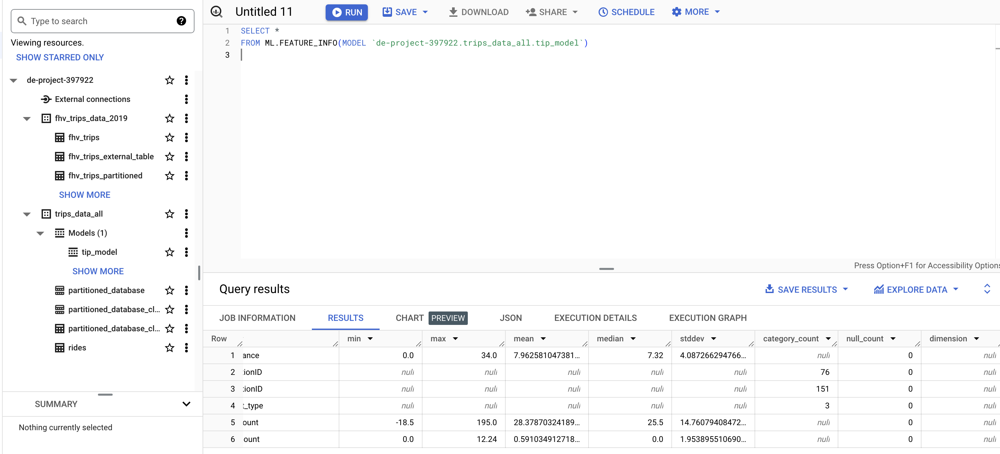

## EVALUATE MODEL

```sql
SELECT *
FROM ML.EVALUATE(MODEL `de-project-397922.trips_data_all.tip_model`,
(SELECT *
FROM `de-project-397922.trips_data_all.partitioned_database_cluster_ml`
WHERE tip_amount IS NOT NULL
));
```

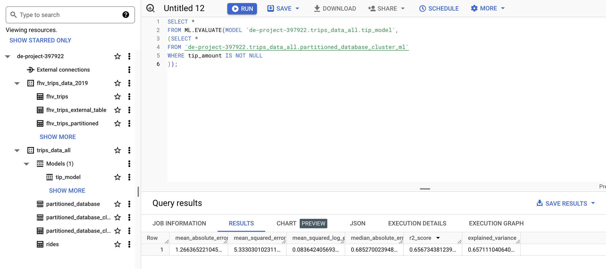

## PREDICT THE MODEL
```sql
SELECT *
FROM ML.PREDICT(MODEL `de-project-397922.trips_data_all.tip_model`,
(
SELECT *
FROM `de-project-397922.trips_data_all.partitioned_database_cluster_ml`
WHERE tip_amount IS NOT NULL
));
```

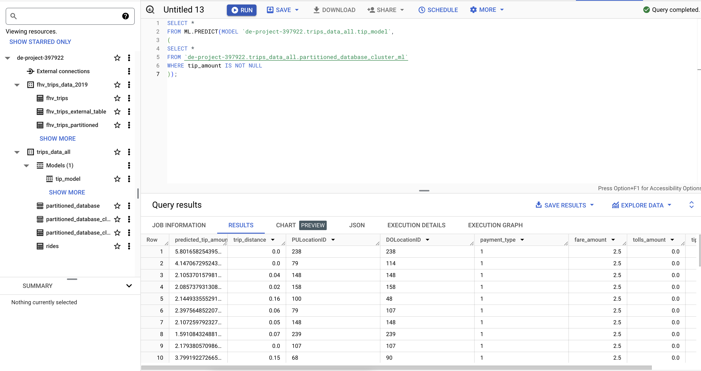

## PREDICT AND EXPLAIN
```
SELECT *
FROM ML.EXPLAIN_PREDICT(MODEL `de-project-397922.trips_data_all.tip_model`,
(
SELECT *
FROM `de-project-397922.trips_data_all.partitioned_database_cluster_ml`
WHERE tip_amount IS NOT NULL
), STRUCT(3 as top_k_features));
```

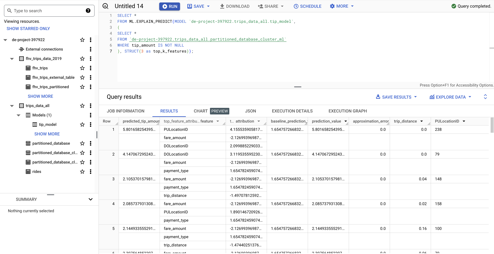


## HYPER PARAM TUNNING
```sql
CREATE OR REPLACE MODEL `de-project-397922.trips_data_all.tip_hyperparam_model`
OPTIONS
    (model_type='linear_reg',
    input_label_cols=['tip_amount'],
    DATA_SPLIT_METHOD='AUTO_SPLIT',
    num_trials=5,
    max_parallel_trials=2,
    l1_reg=hparam_range(0, 20),
    l2_reg=hparam_candidates([0, 0.1, 1, 10])
    ) AS
SELECT *
FROM `de-project-397922.trips_data_all.partitioned_database_cluster_ml`
WHERE tip_amount IS NOT NULL;
```

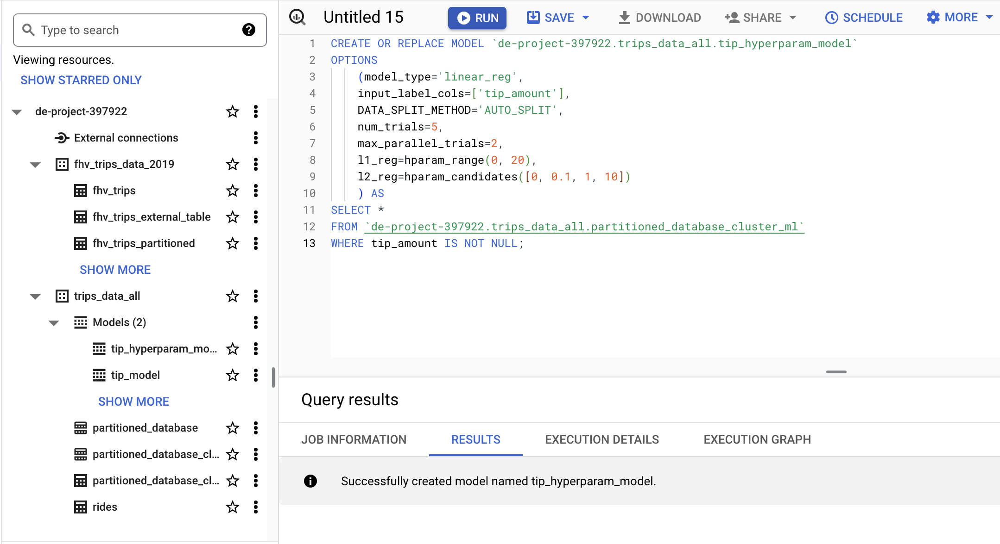image-12.png

**[SQL example for ML in BigQuery](https://github.com/padilha/de-zoomcamp/blob/master/week3/big_query_ml.sql)**

**[BigQuery ML Tutorials](https://cloud.google.com/bigquery-ml/docs/tutorials)**

**[BigQuery ML Reference Parameter](https://cloud.google.com/bigquery-ml/docs/analytics-reference-patterns)**

**[Hyper Parameter tuning](https://cloud.google.com/bigquery-ml/docs/reference/standard-sql/bigqueryml-syntax-create-glm)**

**[Feature preprocessing](https://cloud.google.com/bigquery-ml/docs/reference/standard-sql/bigqueryml-syntax-preprocess-overview)**

**[BigQuery Machine Learning Deployment](https://youtu.be/BjARzEWaznU)**

**[Steps to extract and deploy model with docker](https://github.com/DataTalksClub/data-engineering-zoomcamp/blob/main/week_3_data_warehouse/extract_model.md)**